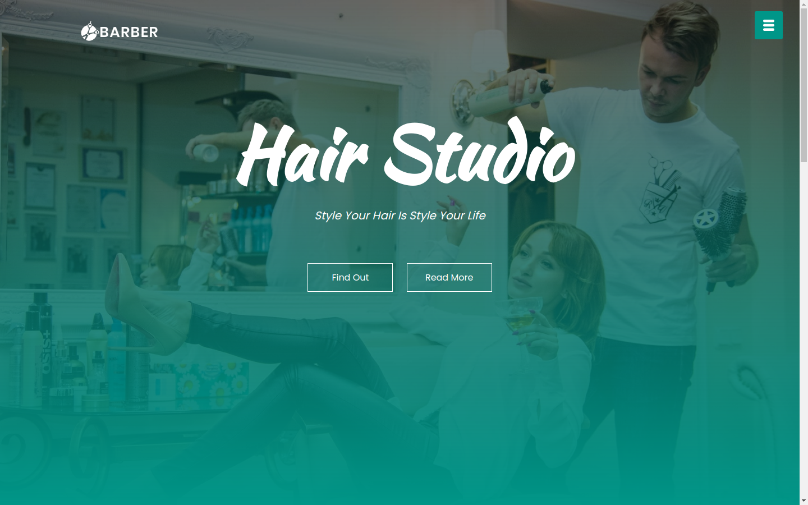

# BarberShop
A modern website built it using HTML, CSS and JS

This websit was built using:
  * HTML semantic tags,
  * External fonts from fonts.google.com,
  * icons from fontawesome,
  * Responsive layout using flex,
  
the website can be seen at https://barbershop-new.netlify.app/

 
